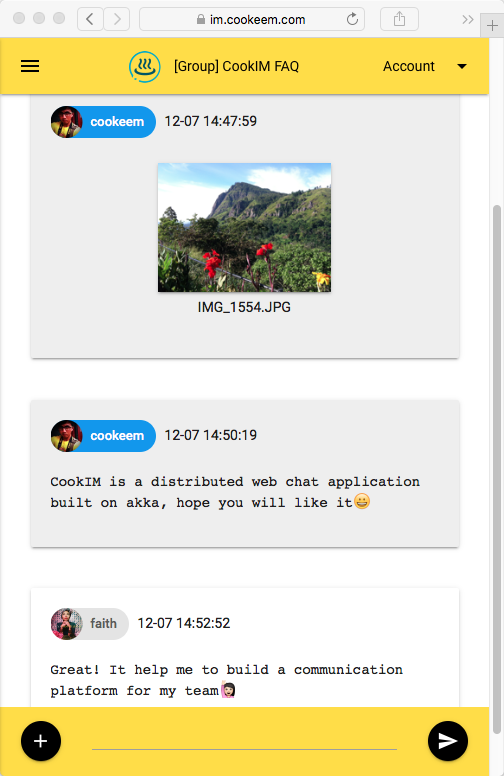
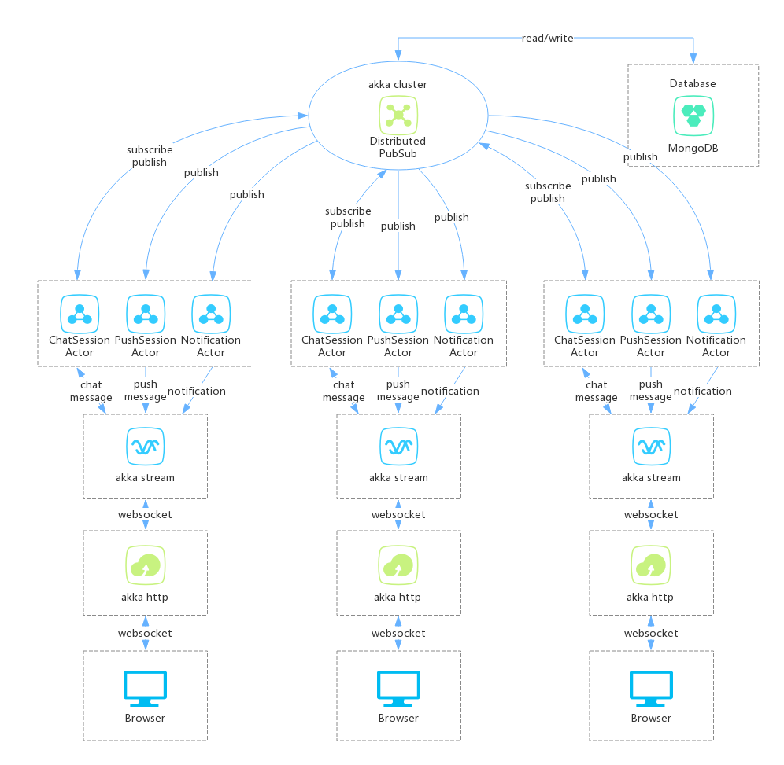
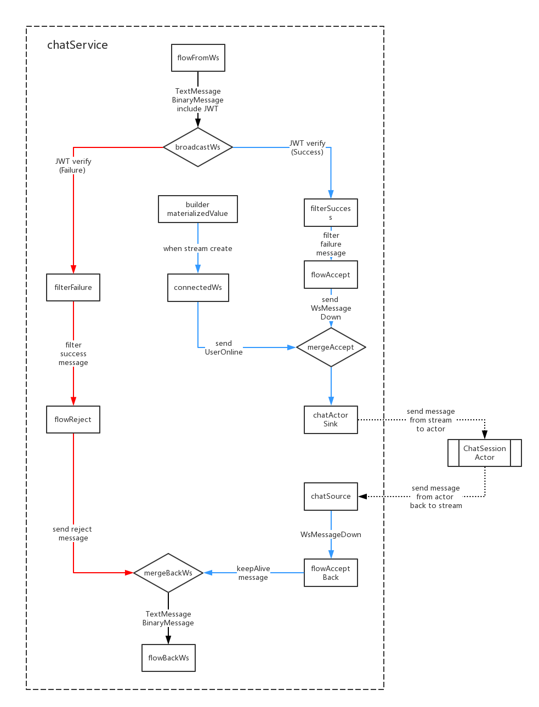

# CookIM - is a distributed websocket chat applications based on akka


- [中文文档](README_CN.md)
- [English document](README.md)

---

- [GitHub project](https://github.com/cookeem/CookIM/)
- [OSChina project](https://git.oschina.net/cookeem/CookIM/)

---

### Category

1. [Demo](#demo)
    1. [Demo on PC](#demo-on-pc)
    1. [Demo on Mobile](#demo-on-mobile)
    1. [Demo link](#demo-link)
1. [Start multiple nodes CookIM in docker compose](#start-multiple-nodes-cookim-in-docker-compose)
    1. [Start docker compose](#start-docker-compose)
    1. [Add nodes in docker compose](#add-nodes-in-docker-compose)
    1. [Debug in docker container](#debug-in-docker-container)
    1. [Stop docker compose](#stop-docker-compose)
1. [How to run](#how-to-run)
    1. [Prerequisites](#prerequisites)
    1. [Clone source code](#clone-source-code)
    1. [Configuration and assembly](#configuration-and-assembly)
    1. [Start CookIM server](#start-cookim-server)
    1. [Open browser and access web port 8080](#open-browser-and-access-web-port-8080)
    1. [Start another CookIM server](#start-another-cookim-server)
    1. [Open browser and access web port 8081](#open-browser-and-access-web-port-8081)
1. [Architecture](#architecture)
    1. [Architecture picture](#architecture-picture)
    1. [akka stream websocket graph](#akka-stream-websocket-graph)
    1. [MongoDB tables specification](#mongodb-tables-specification)
    1. [Websocket message type](#websocket-message-type)
1. [ChangeLog](#ChangeLog)
    1. [0.1.0-SNAPSHOT](#010-snapshot)
    1. [0.2.0-SNAPSHOT](#020-snapshot)

---
[Category](#category)

###Demo

#### Demo on PC

 

#### Demo on Mobile




#### Demo link
[https://im.cookeem.com](https://im.cookeem.com)

---
    
### Start multiple nodes CookIM in docker compose

#### Start docker compose

Change into CookIM directory, run command below, start multiple nodes CookIM servers in docker compose mode. This way will start 3 container: mongo, cookim1 and cookim2
```sh
$ git clone https://github.com/cookeem/CookIM.git

$ cd CookIM

$ sudo docker-compose up -d
Creating mongo
Creating cookim1
Creating cookim2
```

After run docker compose, use different browser to access the URLs below to connect to cookim1 and cookim2
> http://localhost:8080
> http://localhost:8081

---

[Category](#category)

#### Add nodes in docker compose

You can add config in ```docker-compose.yml``` (in CookIM directory) to add CookIM server nodes, this example show how to add cookim3 in docker compose: 
```yaml
      cookim3:
        image: cookeem/cookim
        container_name: cookim3
        hostname: cookim3
        environment:
          HOST_NAME: cookim3
          WEB_PORT: 8080
          AKKA_PORT: 2551
          SEED_NODES: cookim1:2551
        ports:
        - "8082:8080"
        depends_on:
        - mongo
        - cookim1
```
---

[Category](#category)

#### Debug in docker container

View container ```cookim1``` logs output
```sh
$ sudo docker logs -f cookim1
```

Exec into container ```cookim1``` to debug
```sh
$ sudo docker exec -ti cookim1 bash
```
---

[Category](#category)

#### Stop docker compose
```sh
$ sudo docker-compose stop
$ sudo docker-compose rm
```
---

[Category](#category)

### Manual install prerequisites

---

[Category](#category)

### How to run

#### Prerequisites

* JDK 8+
* Scala 2.11+
* SBT 0.13.15
* MongoDB 2.6 - 3.4

---

[Category](#category)

#### Clone source code
```sh
git clone https://github.com/cookeem/CookIM.git

cd CookIM
```
---

[Category](#category)

#### Configuration and assembly

The configuration file locate at ```conf/application.conf```, please make sure your mongodb uri configuration.
```sh
mongodb {
  dbname = "cookim"
  uri = "mongodb://mongo:27017/local"
}
```

Assembly CookIM project to a fatjar, target jar locate at ```target/scala-2.11/CookIM-assembly-0.2.0-SNAPSHOT.jar```
```sh
sbt clean assembly
```

---

[Category](#category)

#### Start CookIM server

CookIM use MongoDB to store chat messages and users data, make sure you startup MongoDB before you startup CookIM.


There are two ways to start CookIM server: sbt and java

a. sbt debug way:
```sh
$ cd #CookIM directory#

$ sbt "run-main com.cookeem.chat.CookIM -h localhost -w 8080 -a 2551 -s localhost:2551"
```
b. java production way:
```sh
$ java -classpath "target/scala-2.11/CookIM-assembly-0.2.0-SNAPSHOT.jar" com.cookeem.chat.CookIM -h localhost -w 8080 -a 2551 -s localhost:2551
```

Command above has start a web server listen port 8080 and akka system listen port 2551

Parameters:

 -a,--akka-port <AKKA-PORT>     akka cluster node port
 
 -h,--host-name <HOST-NAME>     current web service external host name
 
 -n,--nat                       is nat network or in docker(docker mode must set)
 
 -s,--seed-nodes <SEED-NODES>   akka cluster seed nodes, seperate with comma, example:
 
                                localhost:2551,localhost:2552

---

[Category](#category)

#### Open browser and access web port 8080
> http://localhost:8080

---

[Category](#category)

#### Start another CookIM server

Open another terminal, start another CookIM server to test message communication between servers:

a. sbt debug way:
```sh
$ sbt "run-main com.cookeem.chat.CookIM -h localhost -w 8081 -a 2552 -s localhost:2551"
```

b. java production way:
```sh
$ java -classpath "target/scala-2.11/CookIM-assembly-0.2.0-SNAPSHOT.jar" com.cookeem.chat.CookIM -h localhost -w 8081 -a 2552 -s localhost:2551
```

Command above has start a web server listen port 8081 and akka system listen port 2552

---

[Category](#category)

#### Open browser and access web port 8081
> http://localhost:8081

---

[Category](#category)

### Architecture

#### Architecture picture



**CookIM server make from 3 parts: **

> 1. akka http: provide web service, browser connect distributed chat servers by websocket

> 2. akka stream: akka http receive websocket message (websocket message include TextMessage and BinaryMessage), then send message to chatService by akka stream way, websocket message include JWT(Javascript web token), if JWT verify failure, chatService stream will return reject message; if JWT verify success, chatService stream will send message to ChatSessionActor

> 3. akka cluster：akka stream send websocket message to akka cluster ChatSessionActor, ChatSessionActor use DistributedPubSub to subscribe and publish message in akka cluster. When user online session, it will subscribe the session; when user send message in session, it will publish message in akka cluster, the actors who subscribe the session will receive the publish message

---

[Category](#category)

#### akka stream websocket graph



 - When akka http receive messsage from websocket, it will send message to chatService flow, here we use akka stream graph:

> 1. Websocket message body include JWT, flowFromWS use to receive websocket message and decode JWT;

> 2. When JWT verify failure, it will broadcast to filterFailure to filter to fail message; When JWT verify success, it will broadcast to filterSuccess to filter to success message;

> 3. When akka stream created, builder.materializedValue will send message to connectedWs, connectedWs convert message receive to UserOnline message, then send to chatSinkActor finally send to ChatSessionActor; 

> 4. chatActorSink send message to chatSessionActor, when akka stream closed if will send UserOffline message to down stream;

> 5. chatSource receive message back from ChatSessionActor, then send message back to flowAcceptBack;

> 6. flowAcceptBack will let the websocket connection keepAlive;

> 7. flowReject and flowAcceptBack messages finally send to flowBackWs, flowBackWs convert messages to websocket format then send back to users;

---

[Category](#category)

#### MongoDB tables specification

 - users: users table
```
*login (login email)
nickname (nickname)
password (password SHA1)
gender (gender: unknow:0, boy:1, girl:2)
avatar (avatar abs path, example: /upload/avatar/201610/26/xxxx.JPG)
lastLogin (last login timestamp)
loginCount (login counts)
sessionsStatus (user joined sessions status)
    [{sessionid: session id, newCount: unread message count in this session}]
friends (user's friends list: [friends uid])
dateline (register timestamp)
```

 - sessions: sessions table
```
*createuid (creator uid)
*ouid (receiver uid, when session type is private available)
sessionIcon (session icon, when session type is group available)
sessionType (session type: 0:private, 1:group)
publicType (public type: 0:not public, 1:public)
sessionName (session name)
dateline (created timestamp)
usersStatus (users who joined this session status)
    [{uid: uid, online: (true, false)}]
lastMsgid (last message id)
lastUpdate (last update timestamp)
```
 - messages: messages tables
```
*uid (send user uid)
*sessionid (relative session id)
msgType (message type)
content (message content)
fileInfo (file information)
    {
        filePath
        fileName
        fileType
        fileSize
        fileThumb
    }
*dateline (created timestamp)
```

 - onlines: online users table
```
*uid (online user id)
dateline (last update timestamp)
```

 - notifications: receive notifications table
```
noticeType (notification type: "joinFriend", "removeFriend", "inviteSession")
senduid (send user id)
*recvuid (receive user id)
sessionid (relative session id)
isRead (notification is read: 0:not read, 1:already read)
dateline (created timestamp)
```

---

[Category](#category)

#### Websocket message type

There are two websocket channel: ws-push and ws-chat

> ws-push send sessions new message to users, when user not online the session, they still can receive which sessions has new messages

/ws-push channel
```
up message, use to subscribe push message:
{ userToken: "xxx" }

down message:
acceptMsg:     { uid: "xxx", nickname: "xxx", avatar: "xxx", sessionid: "xxx", sessionName: "xxx", sessionIcon: "xxx", msgType: "accept", content: "xxx", dateline: "xxx" }
rejectMsg:     { uid: "", nickname: "", avatar: "", sessionid: "", sessionName: "", sessionIcon: "", msgType: "reject", content: "xxx", dateline: "xxx" }
keepAlive:     { uid: "", nickname: "", avatar: "", sessionid: "", sessionName: "", sessionIcon: "", msgType: "keepalive", content: "", dateline: "xxx" }
textMsg:       { uid: "xxx", nickname: "xxx", avatar: "xxx", sessionid: "xxx", sessionName: "xxx", sessionIcon: "xxx", msgType: "text", content: "xxx", dateline: "xxx" }
fileMsg:       { uid: "xxx", nickname: "xxx", avatar: "xxx", sessionid: "xxx", sessionName: "xxx", sessionIcon: "xxx", msgType: "file", fileName: "xxx", fileType: "xxx", fileid: "xxx", thumbid: "xxx", dateline: "xxx" }
onlineMsg:     { uid: "xxx", nickname: "xxx", avatar: "xxx", sessionid: "xxx", sessionName: "xxx", sessionIcon: "xxx", msgType: "online", content: "xxx", dateline: "xxx" }
offlineMsg:    { uid: "xxx", nickname: "xxx", avatar: "xxx", sessionid: "xxx", sessionName: "xxx", sessionIcon: "xxx", msgType: "offline", content: "xxx", dateline: "xxx" }
joinSessionMsg: { uid: "xxx", nickname: "xxx", avatar: "xxx", sessionid: "xxx", sessionName: "xxx", sessionIcon: "xxx", msgType: "join", content: "xxx", dateline: "xxx" }
leaveSessionMsg:{ uid: "xxx", nickname: "xxx", avatar: "xxx", sessionid: "xxx", sessionName: "xxx", sessionIcon: "xxx", msgType: "leave", content: "xxx", dateline: "xxx" }
noticeMsg:     { uid: "", nickname: "", avatar: "", sessionid: "", sessionName: "xxx", sessionIcon: "xxx", msgType: "system", content: "xxx", dateline: "xxx" }

message push to browser:
pushMsg:       { 
                    uid: "xxx", nickname: "xxx", avatar: "xxx", sessionid: "xxx", sessionName: "xxx", sessionIcon: "xxx", msgType: "xxx", 
                    content: "xxx", fileName: "xxx", fileType: "xxx", fileid: "xxx", thumbid: "xxx",
                    dateline: "xxx" 
               }
```

---

[Category](#category)

> ws-chat is session chat channel, user send and receive session messages in this channel

```
/ws-chat channel
up message: 
onlineMsg:     { userToken: "xxx", sessionToken: "xxx", msgType:"online", content:"" }
textMsg:       { userToken: "xxx", sessionToken: "xxx", msgType:"text", content:"xxx" }
fileMsg:       { userToken: "xxx", sessionToken: "xxx", msgType:"file", fileName:"xxx", fileSize: 999, fileType: "xxx" }<#BinaryInfo#>binary_file_array_buffer

down message:   
rejectMsg:     { uid: "", nickname: "", avatar: "", sessionid: "", sessionName: "", sessionIcon: "", msgType: "reject", content: "xxx", dateline: "xxx" }
keepAlive:     { uid: "", nickname: "", avatar: "", sessionid: "", sessionName: "", sessionIcon: "", msgType: "keepalive", content: "", dateline: "xxx" }
textMsg:       { uid: "xxx", nickname: "xxx", avatar: "xxx", sessionid: "xxx", sessionName: "xxx", sessionIcon: "xxx", msgType: "text", content: "xxx", dateline: "xxx" }
fileMsg:       { uid: "xxx", nickname: "xxx", avatar: "xxx", sessionid: "xxx", sessionName: "xxx", sessionIcon: "xxx", msgType: "file", fileName: "xxx", fileType: "xxx", fileid: "xxx", thumbid: "xxx", dateline: "xxx" }
onlineMsg:     { uid: "xxx", nickname: "xxx", avatar: "xxx", sessionid: "xxx", sessionName: "xxx", sessionIcon: "xxx", msgType: "online", content: "xxx", dateline: "xxx" }
offlineMsg:    { uid: "xxx", nickname: "xxx", avatar: "xxx", sessionid: "xxx", sessionName: "xxx", sessionIcon: "xxx", msgType: "offline", content: "xxx", dateline: "xxx" }
joinSessionMsg:{ uid: "xxx", nickname: "xxx", avatar: "xxx", sessionid: "xxx", sessionName: "xxx", sessionIcon: "xxx", msgType: "join", content: "xxx", dateline: "xxx" }
leaveSessionMsg:{ uid: "xxx", nickname: "xxx", avatar: "xxx", sessionid: "xxx", sessionName: "xxx", sessionIcon: "xxx", msgType: "leave", content: "xxx", dateline: "xxx" }
noticeMsg:     { uid: "", nickname: "", avatar: "", sessionid: "", sessionName: "xxx", sessionIcon: "xxx", msgType: "system", content: "xxx", dateline: "xxx" }

message push to browser:
chatMsg:       { 
                    uid: "xxx", nickname: "xxx", avatar: "xxx", msgType: "xxx", 
                    content: "xxx", fileName: "xxx", fileType: "xxx", fileid: "xxx", thumbid: "xxx",
                    dateline: "xxx" 
               }
```    

---

[Category](#category)


### ChangeLog
#### 0.1.0-SNAPSHOT

---

[Category](#category)

#### 0.2.0-SNAPSHOT

* CookIM now support MongoDB 3.4.4
* Upgrade akka version to 2.5.2
* Update docker-compose startup CookIM cluster readme

---

[Category](#category)